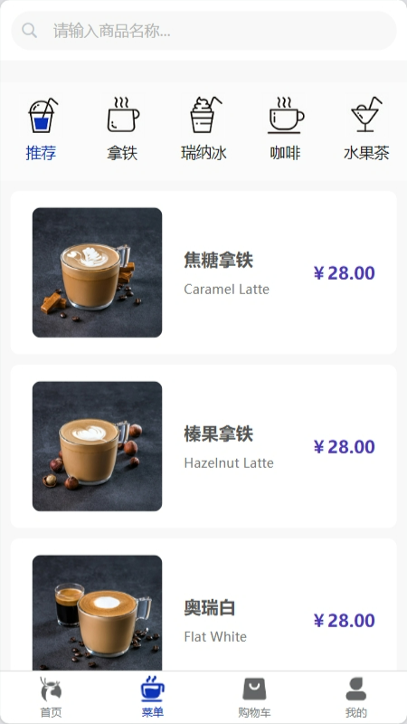
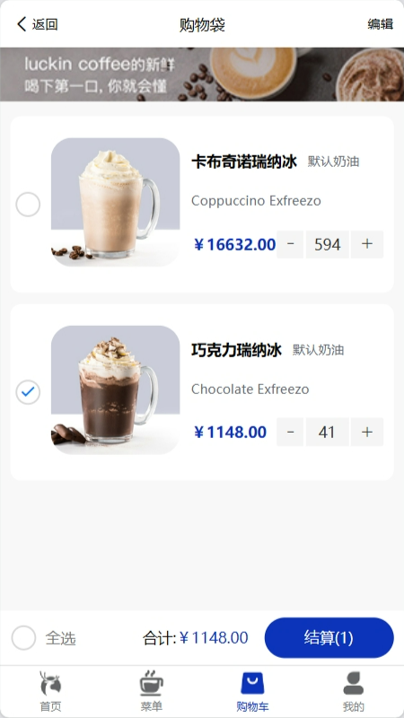
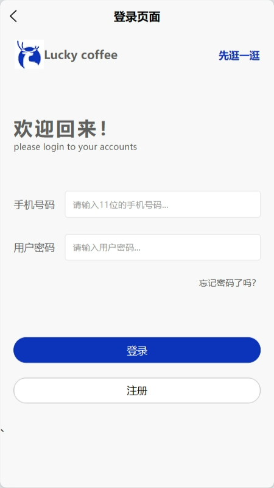
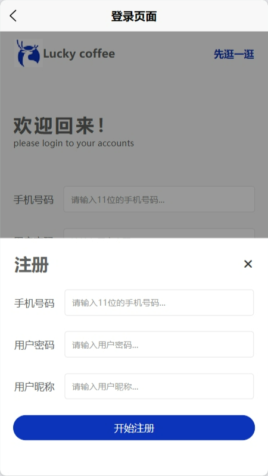
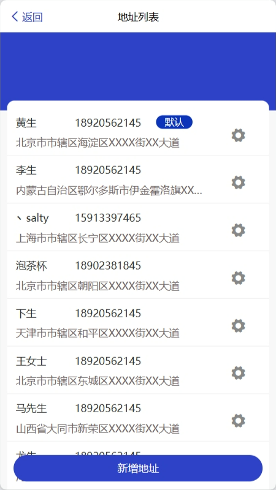
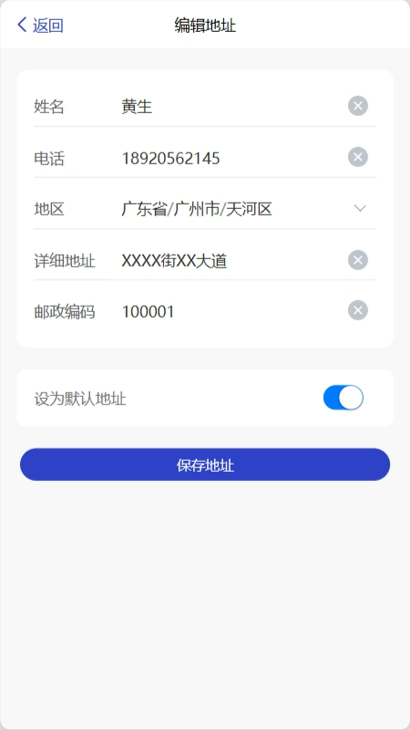
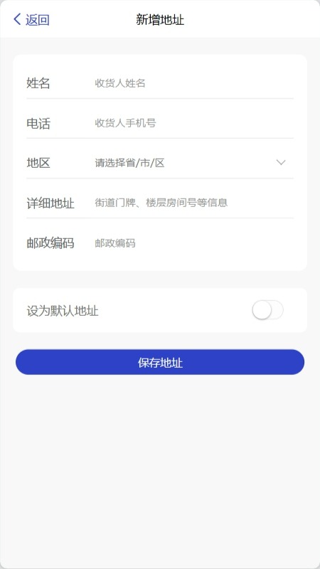
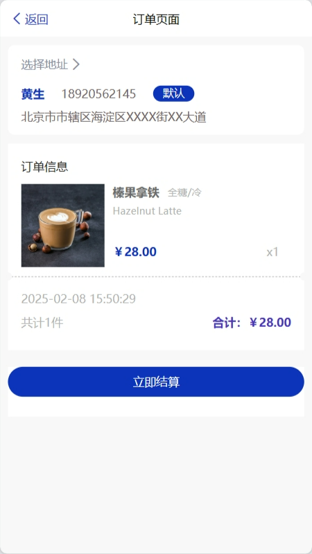
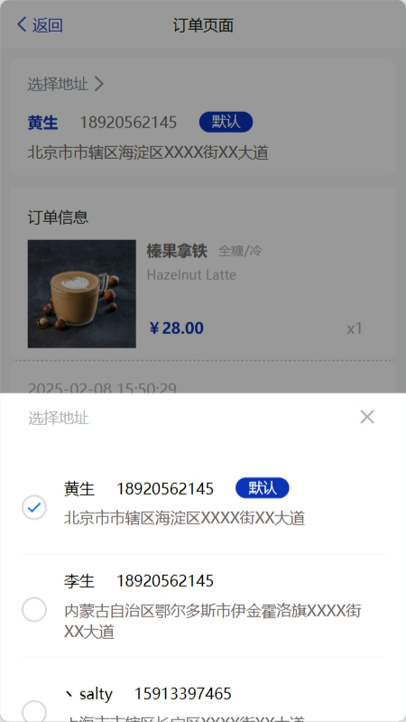

node -v 
v20.10.0

pnpm -v
9.1.4

运行前请安装node_models

用不同包管理器安装依赖
请删除pnpm-lock

h5端运行 npm run dev:h5

node -v 
v20.10.0

pnpm -v
9.1.4

运行前请安装node_models

用不同包管理器安装依赖
请删除pnpm-lock

h5端运行 npm run dev:h5

## 项目展示

以下是项目的部分展示图：

# 首页 (1 张)

# 菜单 (2 张)

# 购物车 (3 张)

# 我的 (2 张)

# 登录 (2 张)

# 地址管理 (4 张)

# 订单 (2 张)

# 商品详情 (2 张)

# 收藏 (1 张)

# 个人信息 (1 张)

# 搜索 (1 张)
